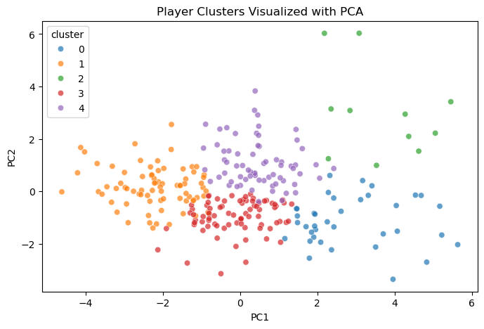
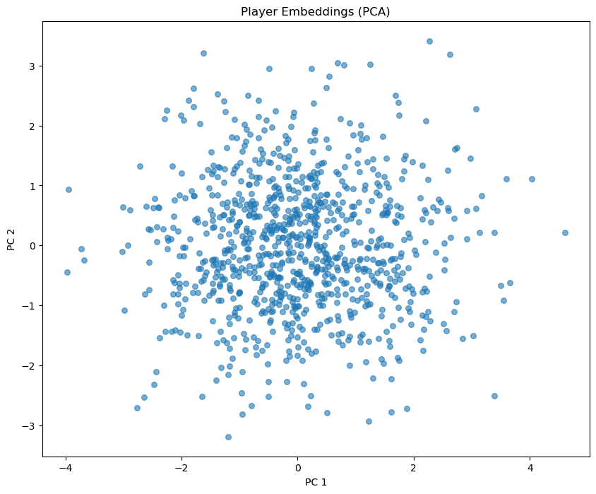
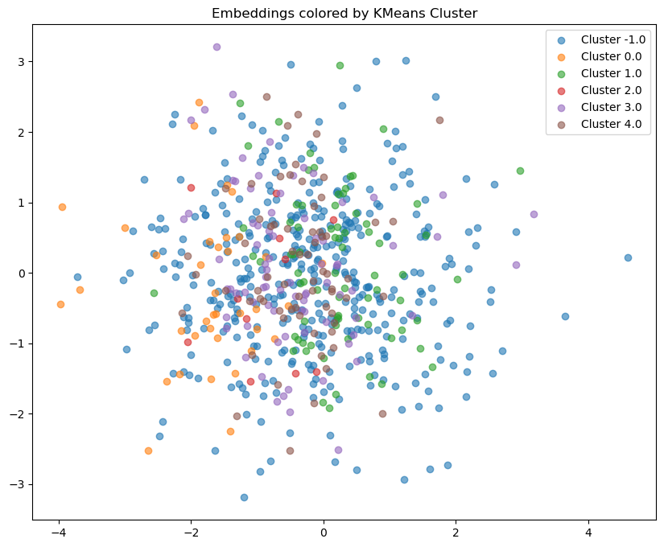

# 🎾 Tennis Match Outcome Prediction & Player Embeddings

## 📌 Project Overview

This project explores **professional tennis match data** to analyze player performance, identify player archetypes, and predict match outcomes using both **classical machine learning** and **deep learning models**.

Using historical ATP match data (2018–2024), we progressively build:
- Player-level statistical profiles
- Unsupervised player clusters
- Match-level predictive models
- Neural networks with **learned player embeddings**

The project emphasizes **rigorous data splitting**, **model comparison**, and **interpretability**, following best practices used in real-world data science projects.

---

## 🎯 Objectives

- Perform exploratory analysis of professional tennis match data  
- Cluster players based on aggregated performance statistics  
- Predict match outcomes using engineered features  
- Compare classical ML models vs neural networks  
- Learn **player embeddings** to capture latent relational patterns  
- Analyze and visualize learned representations  

---

## 📊 Data Source

- **Jeff Sackmann’s ATP Tennis Dataset**
- Covers professional men’s tennis matches
- Includes match results, player rankings, surfaces, tournament levels, and basic stats

**Time range used:**
- **2018–2023** → player statistics & clustering  
- **2018–2022** → training set  
- **2023** → validation set  
- **2024** → test set (strictly held out)

This temporal split avoids data leakage and reflects real-world forecasting conditions.

---

## 🔍 Exploratory Data Analysis

Key insights:
- Match outcomes are strongly influenced by ranking differences  
- Player statistics vary significantly by surface  
- Tennis performance lies on **continuous gradients**, not discrete categories

EDA notebooks focus on:
- Match distributions  
- Player longevity and participation  
- Surface effects  
- Ranking dynamics

---

## 🧩 Player Clustering

Players are clustered using **KMeans** based on aggregated statistics (2018–2023), such as:
- Average ranking  
- Age  
- Height  
- Match participation

---

### Player Clustering Profiles

| Cluster | Avg Rank | Win Rate | Avg Height | Key Trait                     | Interpretation                |
| ------- | -------- | -------- | ---------- | ----------------------------- | ----------------------------- |
| 0       | 52       | 0.64     | 190 cm     | Strong across surfaces        | High-performance all-rounders |
| 1       | 158      | 0.33     | 183 cm     | Low surface winrates          | Lower-tier players            |
| 2       | 59       | 0.55     | 200 cm     | 16+ avg aces, strong on grass | Big servers / power players   |
| 3       | 85       | 0.47     | 183 cm     | Balanced profile              | Solid mid-level competitors   |
| 4       | 102      | 0.44     | 190 cm     | Surface variability           | Inconsistent / specialists    |

The clustering results reveal meaningful structural differences between player types. In particular, Cluster 2 clearly captures tall, high-ace, grass-favored players, suggesting that the learned embeddings encode playing style characteristics rather than only ranking strength. However, as the image below shows, there is **significant overlap** between clusters, reflecting the continuous nature of tennis skills.

---

### PCA Projection of Clusters

  

---

## ⚙️ Match Outcome Prediction

### Features
- Rank difference  
- Age difference  
- Height difference  
- Player cluster difference  
- Surface (One-Hot encoded)  
- Tournament level (One-Hot encoded)

Each match is transformed into **two samples**:
- Winner vs Loser → target = 1  
- Loser vs Winner → target = 0

This framing allows symmetric learning of win probabilities.

---

---

## ♟️ Dynamic Rating Feature — ELO Implementation

To incorporate temporal player strength dynamics, a **global ELO rating system** was implemented and computed sequentially from 2018–2024 before any data splitting.

### Why ELO?

Static features such as:
- Ranking
- Age
- Height
- Cluster membership

do not capture performance evolution over time.

ELO introduces:

- Sequential strength updates  
- Momentum tracking  
- Historical performance compression  
- Implicit time-awareness  

Each match updates both players’ ratings based on expected win probability:

$$
E_A = \frac{1}{1 + 10^{(R_B - R_A)/400}}
$$

$$
R_A' = R_A + K (S_A - E_A)
$$

Where:
- $R_A$ = current rating  
- $S_A$ = match outcome (1 = win, 0 = loss)  
- $E_A$ = expected probability  
- $K$ = update factor

The final feature used in prediction models is the difference of ELOs ratings of the two players involved in the match. 
ELO ratings were computed sequentially across seasons (2018–2024) before splitting the dataset, ensuring that each match rating only used past information and preventing data leakage.

## 📈 Models & Results

### Logistic Regression (baseline)
- Validation ROC-AUC ≈ **0.67**
- Test ROC-AUC (2024) ≈ **0.67**

### Neural Network (PyTorch)
- Fully connected network  
- Improved flexibility over linear models  
- Test ROC-AUC ≈ **0.68**

### Neural Network with Player Embeddings
- Introduces learnable embeddings for each player  
- Captures relational information between players  
- Slightly lower predictive performance due to higher model complexity and limited data  
- Enables deeper **representation analysis**

---

### 🔥 Models with Global ELO Feature

Adding the dynamic ELO rating produced a significant performance improvement.

| Model                | Test Accuracy | Test ROC-AUC |
|----------------------|--------------|--------------|
| Logistic Regression  | **0.6466**   | **0.7118**   |
| Neural Network       | **0.6489**   | **0.7122**   |

Introducing ELO increased ROC-AUC by approximately **+0.03** on unseen 2024 data. This improvement was consistent across both linear and neural models.

### Surface-Specific ELO Experiment

A surface-specific ELO system (separate ratings per player per surface) was also implemented and evaluated.

However, it did **not** improve performance over global ELO:

- Logistic Regression ROC-AUC: 0.7107  
- Neural Network ROC-AUC: 0.7116  

This suggests that, given the dataset size (2018–2024), global strength dynamics were sufficient and more stable than surface-separated ratings.

---

## 🧠 Player Embeddings Analysis

Learned player embeddings are:
- Visualized using PCA  
- Compared against KMeans clusters  
- Used to compute player similarity

Key findings:
- Embedding space is **continuous**, not sharply clustered  
- Embeddings capture relational patterns not explained by static statistics  
- Elite players tend to cluster near each other, but overlap remains high

Example:
- Rafael Nadal’s nearest neighbors include Novak Djokovic and Juan Martín del Potro, reflecting shared competitive contexts.

---

### PCA Projection of Player Embeddings

  

The embedding space forms a continuous cloud rather than sharply separated groups.

This indicates that tennis skill and player characteristics exist on gradients rather than discrete categories.

---

### Embeddings vs KMeans Clusters

  

When coloring embeddings by cluster label:

- There is noticeable overlap.
- Embeddings do not perfectly replicate clustering.

This suggests that embeddings capture relational match dynamics rather than static player attributes.

Clustering describes *who players are statistically*.  
Embeddings describe *how players interact competitively*.

---

## 🧪 Evaluation Metrics

- Accuracy  
- ROC-AUC  
- Confusion matrices  
- Validation-driven model selection

The **2024 season** is kept fully unseen until final evaluation.

---

## 🧠 Key Takeaways

## 🧠 Key Takeaways

- Feature engineering had a larger impact than increasing model complexity  
- Introducing a dynamic ELO rating improved ROC-AUC from ~0.68 to ~0.71  
- Logistic Regression performed nearly as well as Neural Networks once strong features were introduced  
- Surface-specific modeling did not outperform global strength modeling  
- Temporal validation is essential in sports analytics to prevent leakage  

This project highlights a central principle of applied machine learning:

> Well-designed features often drive larger improvements than more complex architectures.

---

## 🚀 Future Work

- Surface-specific player embeddings  
- Sequence-based models (match history as time series)  
- Bayesian or Elo-style hybrid models  
- Women’s tennis (WTA) extension  
- Live betting probability calibration

---

## 🛠️ Tech Stack

- Python  
- NumPy, Pandas  
- Scikit-learn  
- PyTorch  
- Matplotlib / Seaborn

---

## 👤 Author

**Javier Luna Quesada**  
Data Science & Machine Learning Enthusiast  
🎾 Sports analytics | 🤖 Applied ML | 📊 Data-driven insights